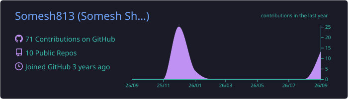
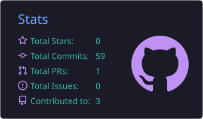
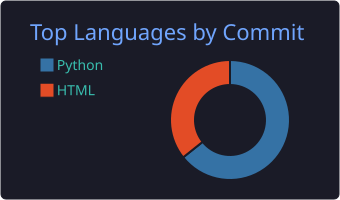
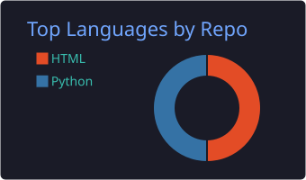
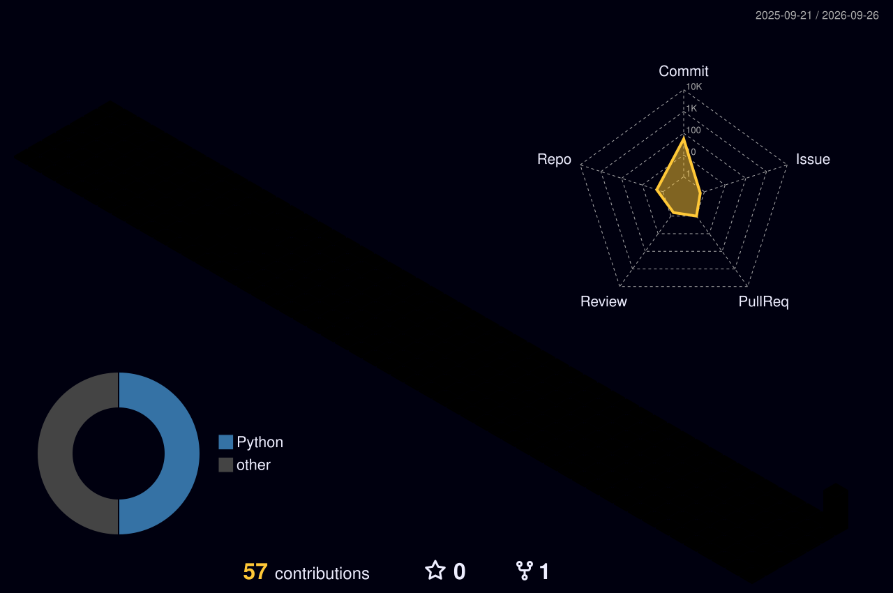

<!-- ===== Animated wave header ===== -->

  

<!-- ===== Typing animation ===== -->

  

<!-- ===== Badges ===== -->

  
  

  
  
  
  
  

<!-- ===== Quick navigation ===== -->

  
  
  
  
  
  

---

## 🧑‍💻 About Me

  

  

<b>⚡ Click to know me better</b>

 

| | |
|---|---|
| 🎯 **Goal** | Build AI products that solve real-world problems |
| ⚡ **Fun fact** | I enjoy turning real-world problems into AI-powered solutions |
| 🤝 **Open to** | Collaborating on AI/ML and full-stack projects |
| 📫 **Reach me** | [someshsharma8132@gmail.com](mailto:someshsharma8132@gmail.com) |

  

---

## 🚀 Featured Projects

  
  

  
  

## 🏅 Coding Profiles

  
  
  

---

## ⚡ Recent Activity

<!--START_SECTION:activity-->
1. 💪 Opened PR [#1](https://github.com/Somesh813/sqlpilot/pull/1) in [Somesh813/sqlpilot](https://github.com/Somesh813/sqlpilot)
<!--END_SECTION:activity-->

🤖 Updated automatically every 6 hours by GitHub Actions

---

## 🛠️ Tech Stack

  

---

## 📊 GitHub Stats

  

  
  

  
  

## 🧊 3D Contributions

  

## 🐍 Contribution Snake

  <picture>
    <source media="(prefers-color-scheme: dark)" srcset="https://raw.githubusercontent.com/Somesh813/Somesh813/output/github-snake-dark.svg" />
    <source media="(prefers-color-scheme: light)" srcset="https://raw.githubusercontent.com/Somesh813/Somesh813/output/github-snake.svg" />
    
  </picture>

---

  

<!-- ===== Animated wave footer ===== -->

  

